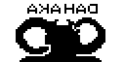

# Akahad
This was my XO-Chip submission for Octojam 8. It is (as of writing) easily playable at https://chromatophore.itch.io/akahad

It's written for Octo, a high-level assembler for Chip 8, an 8 bit assembly language from the 1970s: https://github.com/JohnEarnest/Octo

This game was inspired by the number 8 and its similarity to the infinity symbol. Several connections were made and we now have some kind of Warrior Within fan game? Of course, due to the platform, it is quite straight forwards.

## Controls

Ride the time line and catch the elusive Ecnirp, and make sure that he doesn't escape his fate! (Also, the text is backwards on purpose)

**W** - Jump

**Hold S** - Become ball to avoid walls (but also everything)

**S while jumping** - Butt Slam

**A (with boost guage)** - Slow Motion

**D (with boost guage)** - Speed Up (and break through walls)

Some updates have been made since the submission at the end of the jam:

New animations between levels & also like, reasonable required scores, and progression, or something.